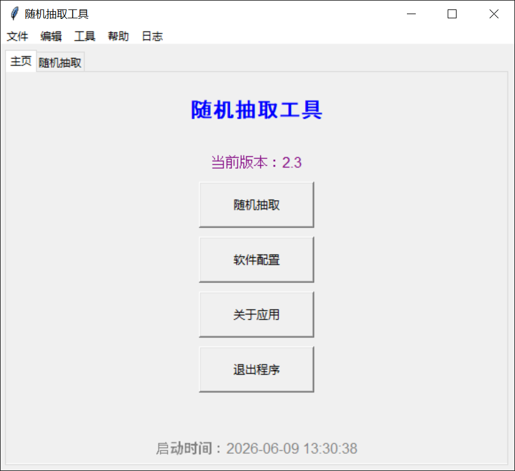
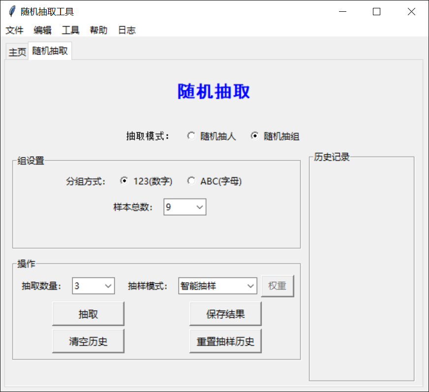
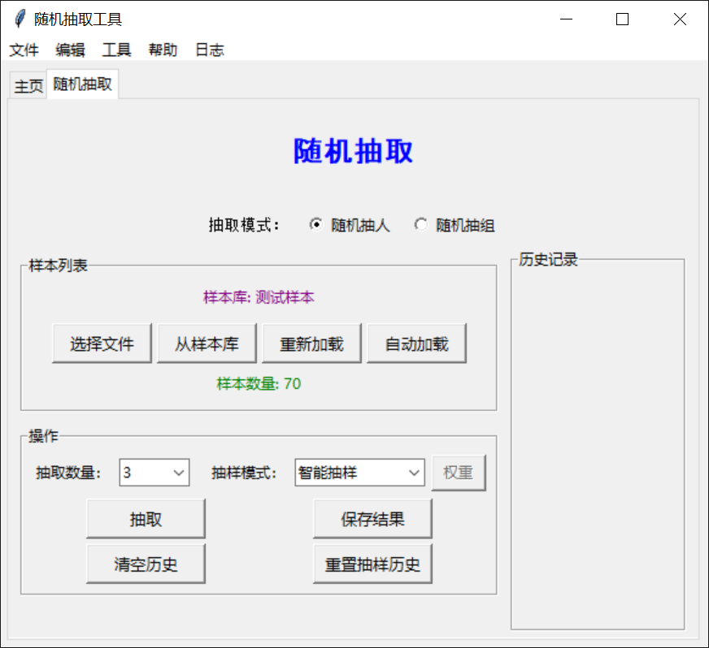
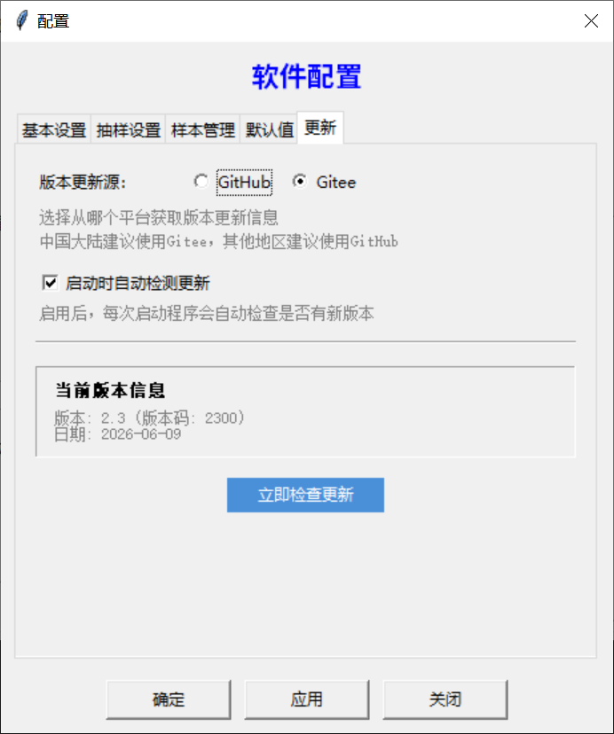

# 随机抽取工具

[官方网站](https://rct.danevan.top/) | [GitHub](https://github.com/danevan/RandomCallTool) | [Gitee](https://gitee.com/danevan/RandomCallTool)

## 简介

随机抽取工具（RandomCallTool）是一个基于 Python3 + tkinter 的桌面应用程序，拥有 **随机抽组** 和 **随机抽人** 两大功能。

主程序提供 **随机抽组** 和 **随机抽人** 两大功能模块，并内置三档可切换的抽样模式（基本抽样/智能抽样/加权抽样）。

配套的 **名单编码工具** 用于将明文名单编码为 RCP 文件，供主程序的"随机抽人"功能使用。

>[!NOTE]
> 该项目优先支持 Windows 操作系统环境。对于 Linux 和 macOS 可能支持不佳。

>[!TIP]
> 你可以阅读 [官网文档](https://rct.danevan.top/docs/) 获取更详细的使用说明和最新更新日志。

## 主程序

### 主要功能

1. **随机抽组**：支持从数字（1-26）或字母（A-Z）中随机抽取指定数量的组。
2. **随机抽人**：支持从样本文件（`.rcp` / `.txt` / `.csv`）或样本库中随机抽取指定数量的人名。
3. **三档抽样模式**：
   - **基本抽样**（模式 0）：`random.sample` 简单随机抽取。
   - **智能抽样**（模式 1）：追踪近期抽取历史，自动降低刚被选中项的权重。
   - **加权抽样**（模式 2）：可为每个样本单独设置权重，权重越高被抽中的概率越大。
4. **样本库管理**：可将常用名单导入样本库（上限 50 个），支持从样本库快速加载。
5. **整合式操作界面**：抽人与抽组在一个选项卡内自由切换，交互流畅。
6. **历史记录面板**：右侧面板展示抽取历史，支持单条保存和批量保存全部历史。
7. **配置管理**：多选项卡配置窗口（基本设置、抽样设置、样本管理、默认值、更新设置），支持自动保存结果、保存路径、自动加载样本等选项。
8. **自动检测更新**：启动时静默检测 GitHub/Gitee 新版本，发现新版本时弹窗提示下载。
9. **详细日志记录**：按日期滚动记录程序运行状态，支持查看和清理日志文件。
10. **快捷键操作**：丰富的键盘快捷键支持，提升操作效率。

## 名单编码工具

### 主要功能

1. **编码转换**：支持 **Base64** 和 **Hex** 两种编码方式，将明文名单转换为 RCP 文件。
2. **文本处理**：去除重复项、首尾空格、空行，支持按字母排序。
3. **批量编码/解码**：支持对整个目录下的 `.txt` 文件进行批量编码，支持批量解码测试。
4. **命令行模式**：支持命令行参数直接指定文件、批量目录、编码方式等。
5. **编码测试与验证**：内置解码测试和编码/解码循环验证功能。
6. **最近文件管理**：记录最近打开的文件列表，快速重新加载。
7. **统计信息**：显示输入文本的行数、字数等统计信息。
8. **配置管理**：通过多选项卡配置窗口设置输出路径、编码方式、文本处理选项等。
9.  **窗口状态恢复**：自动保存和恢复窗口位置与大小。
10. **日志记录**：记录程序运行状态，便于调试和查看。

## 卸载工具

项目附带独立的卸载工具 `remove.exe`，提供两种卸载模式：

- **保留数据卸载**：仅移除程序文件，保留配置、日志和结果数据。
- **完全卸载**：移除程序文件及所有用户数据。

## 注意事项

>[!IMPORTANT]
>1. 程序支持三大平台（Windows / Linux / macOS），但仅提供 Windows 编译版本。
>2. 从 **GitHub** / **Gitee** / **网盘链接** 下载最新版本手动安装更新时，请先关闭 **随机抽取工具**、**名单编码工具** 等所有 **随机抽取工具套件** 内的程序，再运行安装包，否则会因为占用问题安装失败，并影响到程序完整性,造成程序运行出错或数据损坏等严重问题。

## 截图（来自2.3版本）

随机抽取工具主界面（主页选项卡）

随机抽组功能

随机抽人功能

多选项卡配置界面

## 编译与运行（Windows）

1. 确保安装了 **Python 3.6 及以上** 版本环境（建议使用 3.8 及以上版本，推荐 3.12）。
2. 下载或 `git clone` 项目到本地。
3. 打开命令行或终端，进入项目目录。
4. 运行 `pip install pyinstaller` 安装 PyInstaller。
5. 运行根目录下的构建脚本，生成可执行文件：
   - `build_standard.bat` — 标准目录构建（标准打包，依赖包外置于 `_internal` 目录）。
   - `build_onefile.bat` — 单文件构建（每个程序打包为单个独立 exe，依赖包内置）。
6. （可选）使用 **7z SFX Builder** 搭配 `SFX_config.txt`（需自行修改部分目录）打包自解压安装程序。

>[!NOTE]
> 7z SFX Builder 可从 [蓝奏云网盘](https://lzofevan.lanzn.com/ipqhQ3p9nk2d) 下载（密码:8kmj）。

>[!TIP]
> 或者可以直接下载 Release 版本并直接运行。

## 仓库

- **GitHub**：[https://github.com/ElofHew/RandomCallTool](https://github.com/ElofHew/RandomCallTool)
- **Gitee**：[https://gitee.com/ElofHew/RandomCallTool](https://gitee.com/ElofHew/RandomCallTool)

>[!NOTE]
> 注：本项目约50%为AI代码，开发者在尝试 Vibe Coding 后发现这真是个好东西（bushi，但是出于代码质量，开发者在AI生成后会人工审查并修改，故不能完全视作AIGC项目，。（应该不能……）（反正有些文档什么的我直接让AI生成应该不过分吧……）

---

&copy; 2025~2026 ElofHew