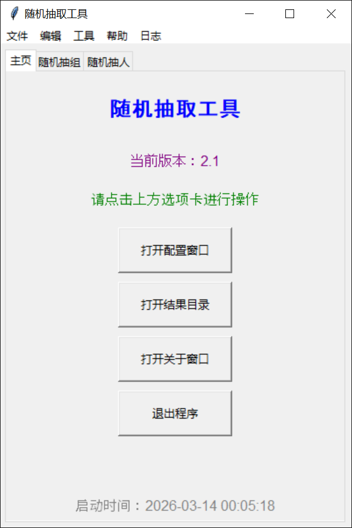
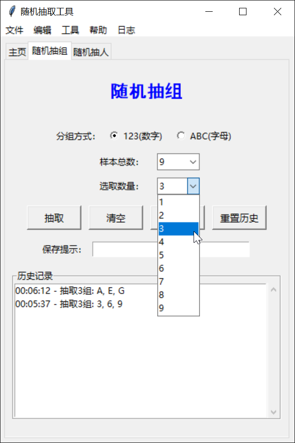
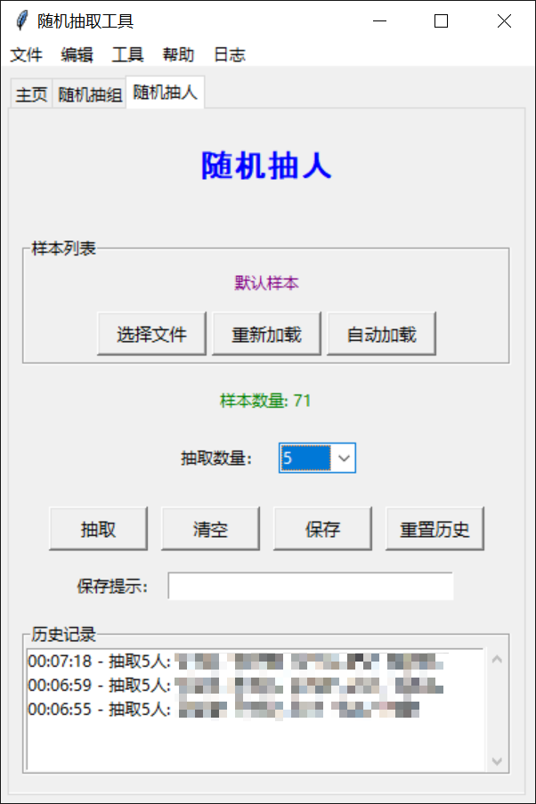
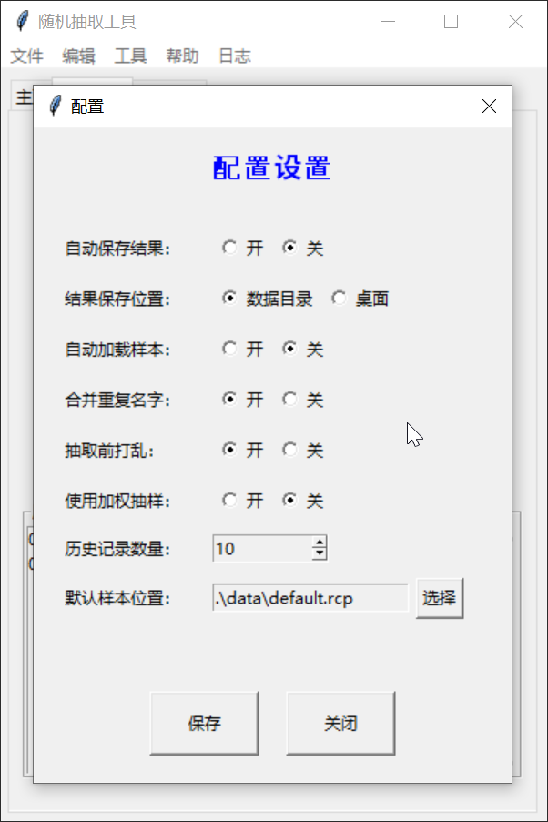
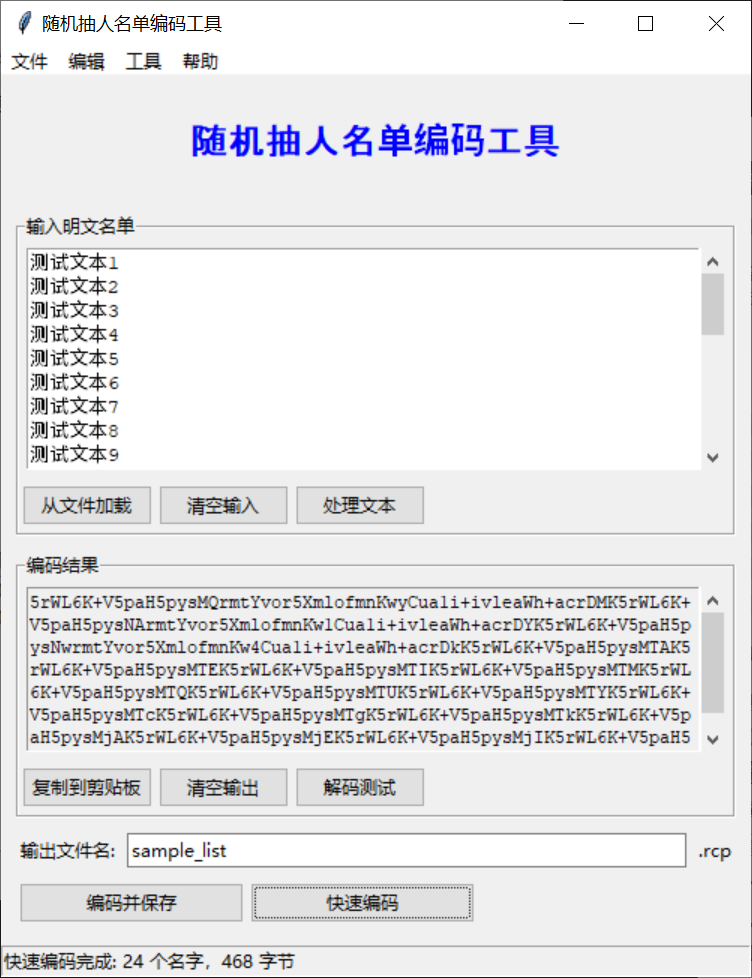

# 随机抽取工具

## 简介

随机抽取工具是一个基于Python3和tkinter的桌面应用程序，主要用于在指定人员名单或组中进行随机抽取。

支持简单随机抽样、加权随机抽样，提供清晰的用户界面和详细的日志记录功能。

随机抽人名单编码工具用于将明文名单转换为Base64编码的RCP文件，配套于随机抽取工具的“随机抽人”功能。

## 主程序

### 主要功能

1. **随机抽组**：支持从数字（1-26）或字母（A-Z）中随机抽取指定数量的组。
2. **随机抽人**：支持从样本文件中随机抽取指定数量的人名，样本文件支持`.rcp`、`.txt`和`.csv`格式。
3. **智能抽样**：提供加权随机抽样选项，确保长期的公平性；支持抽取前打乱样本列表。
4. **历史记录**：记录最近的抽取历史，便于查看和管理。
5. **配置管理**：支持配置自动保存结果、保存路径、自动加载样本等选项。
6. **日志记录**：详细记录程序运行状态，方便调试和查看。

### 使用说明

1. **随机抽组**：
    - 选择分组方式（数字或字母）。
    - 输入总组数和要抽取的组数。
    - 点击“抽取”按钮进行随机抽取。
    - 结果展示在程序窗口，并可保存为HTML文件。

2. **随机抽人**：
    - 加载样本文件，支持手动选择、自动加载默认文件或重新加载当前文件。
    - 输入要抽取的人数。
    - 点击“抽取”按钮进行随机抽取。
    - 结果展示在程序窗口，并可保存为HTML文件。

3. **配置设置**：
    - 打开配置窗口，调整自动保存结果、结果保存位置、自动加载样本等设置。
    - 点击“保存”按钮保存配置，点击“关闭”按钮关闭配置窗口。

4. **查看日志**：
    - 通过菜单栏“日志”选项查看和清除日志文件。

### 注意事项

1. 支持重复名字自动去重。
2. 抽取人数不能超过样本总数 (自动规避)。
3. 默认样本文件存放在`data/default.rcp`。
4. 结果文件默认保存在`data/result`目录或桌面，具体位置可在配置中设置。

## 随机抽人名单编码工具

### 主要功能

1. **编码转换**：将明文名单转换为Base64编码的RCP文件。
2. **文本处理**：去除重复项和首尾空格。
3. **配置管理**：设置输出路径、默认文件名和自动处理选项。
4. **日志记录**：记录程序运行状态，便于调试和查看。

### 使用说明

1. **输入明文名单**：
    - 在左侧文本框中输入名单（每行一个名字）。
    - 点击“从文件加载”导入文本文件。

2. **处理文本（可选）**：
    - 点击“处理文本”自动去除重复项和空格。

3. **编码名单**：
    - 点击“快速编码”仅生成编码后的文本。
    - 点击“编码并保存”生成并保存为RCP文件。

4. **输出文件**：
    - 编码结果会显示在下方文本框中。
    - 点击“复制到剪贴板”将编码后的文本复制到剪贴板。
    - 点击“编码并保存”将编码后的文件保存到指定位置。

5. **配置选项**：
    - 点击“配置”按钮设置输出路径、默认文件名等。
    - 配置会自动保存。

### 注意事项

1. 输入的名单应每行一个名字。
2. 仅支持Windows系统。
3. 默认情况下，编码后的文件保存在`data/encoded_files`目录，也可以设置为保存在桌面。

## 截图

随机抽取工具主界面

随机抽组功能

随机抽人功能

配置界面

名单生成工具主界面

## 安装和运行

>[!NOTE]
> 该项目仅支持Windows操作系统环境，对于Linux和MacOS用户，可能需要先自行修改源码后手动编译。

1. 确保安装了Python 3.6及以上版本环境 (建议使用3.10及以上版本，推荐3.12)。
2. 下载或克隆项目到本地。
3. 打开命令行或终端，进入项目目录。
4. 运行 `pip install pyinstaller` 安装PyInstaller。
5. 运行根目录下的 `build.bat` 脚本，生成可执行文件。
6. 运行 `main.exe` 运行程序。

>[!TIP]
> 或者可以直接下载Release版本并直接运行。

## 仓库

- **GitHub**：[https://github.com/ElofHew/RandomCallTool](https://github.com/ElofHew/RandomCallTool)
- **Gitee**：[https://gitee.com/ElofHew/RandomCallTool](https://gitee.com/ElofHew/RandomCallTool)

---

&copy; 2025~2026 ElofHew
