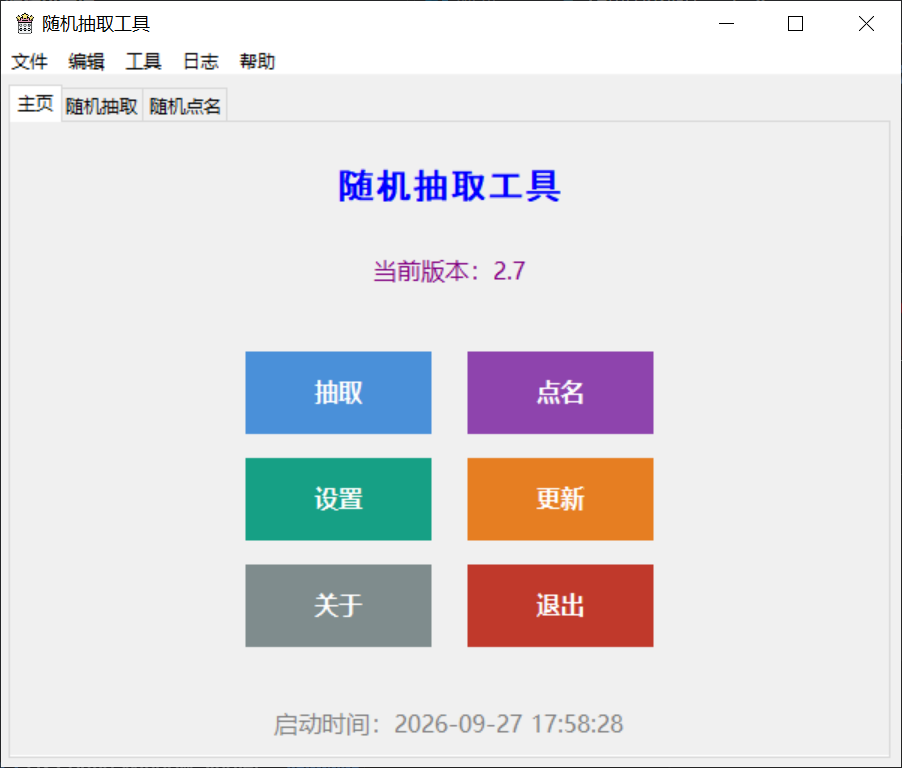
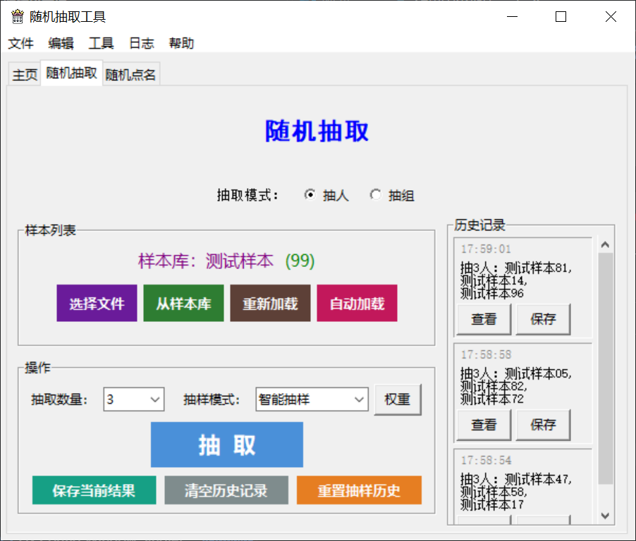
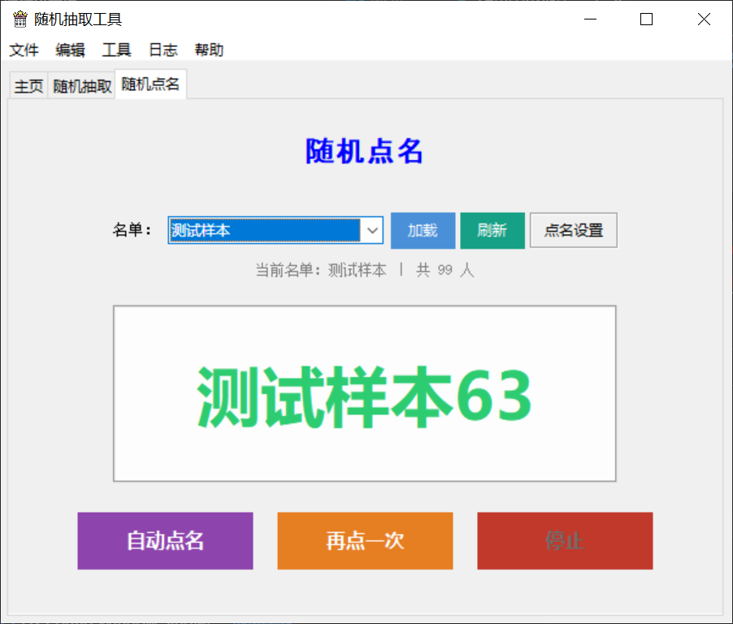
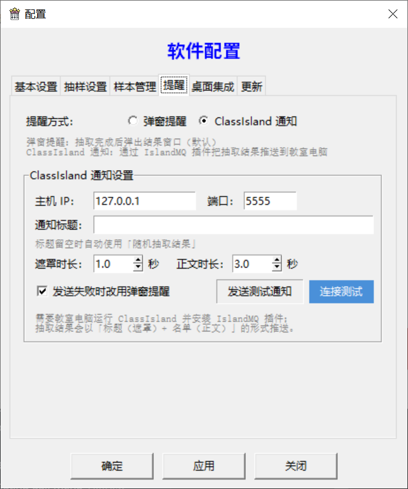
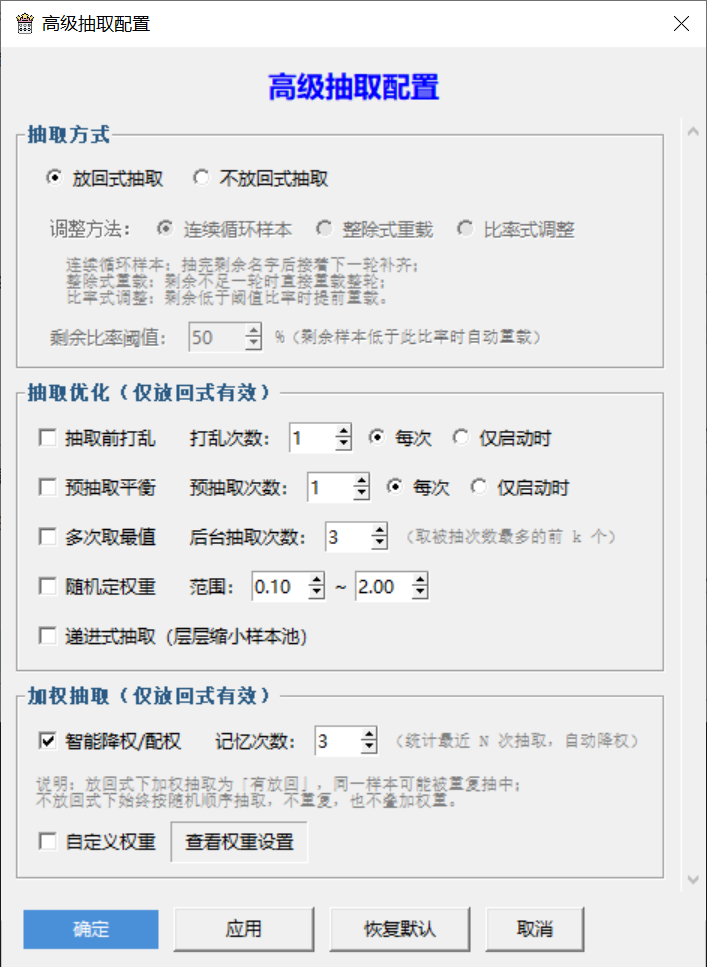

# 随机抽取工具

[官方网站](https://rct.danevan.top/) | [GitHub](https://github.com/ElofHew/RandomCallTool) | [Gitee](https://gitee.com/ElofHew/RandomCallTool)

## 简介

随机抽取工具（RandomCallTool）是一个基于 Python3 + tkinter 的桌面应用程序，拥有 **随机抽组**、**随机抽人**、**随机点名** 三大功能。

主程序内置三档可切换的抽样模式（基本抽样/智能抽样/高级抽样），并配套独立的 **更新程序** 与 **卸载工具**。

>[!NOTE]
> 该项目优先支持 Windows 操作系统环境。对于 Linux 和 macOS 可能支持不佳。

>[!TIP]
> 你可以阅读 [官网文档](https://rct.danevan.top/docs/) 获取更详细的使用说明和最新更新日志。

## 主程序

### 主要功能

1. **随机抽组**：支持从数字（1-26）或字母（A-Z）中随机抽取指定数量的组。
2. **随机抽人**：支持从样本文件（`.rcp` / `.txt` / `.csv`）或样本库中随机抽取指定数量的人名。
3. **随机点名**：跑马灯式点名，名字快速跳动后点击「停止」即可定格；支持自动点名（随机速率、到时自动停止）与点名优化（点名前打乱名单、放回式/不放回式、剩余人数重置限度）。
4. **三档抽样模式**：
   - **基本抽样**（模式 0）：`random.sample` 简单随机抽取。
   - **智能抽样**（模式 1）：追踪近期抽取历史，自动降低刚被选中项的权重，也可切换为固定权重。
   - **高级抽样**（模式 2）：完整的高级抽取配置，涵盖放回/不放回、抽取前打乱、预抽取平衡、多次取最值、随机定权重、递进式抽取、自定义权重等。
5. **样本库管理**：可将常用名单导入样本库（上限 50 个），支持重命名、删除以及导出为 `RCP` / `TXT`。
6. **整合式操作界面**：抽人与抽组在同一选项卡内自由切换，交互流畅。
7. **历史记录面板**：右侧面板展示抽取历史，支持单条保存和批量保存全部历史。
8. **抽取历史记录文件**：每次抽取会实时追加一行到 `data/history/YYYY-MM-DD.txt`，按日期分文件，格式为 `[HH:MM:SS]：随机抽人：抽取数量3：张三、李四`，可在配置中关闭。菜单「日志 → 打开今日历史记录」可直接打开当天的记录；「清除全部历史记录」会一并清空面板与全部记录文件。
9. **抽取后提醒**：可选「弹窗提醒」（默认）或「ClassIsland 通知」——通过 IslandMQ 插件把**随机抽取的结果**推送到教室电脑，遮罩 / 正文显示时长可自定义（默认 1 秒 / 3 秒），通知失败时可自动回退弹窗。随机点名不触发提醒，点中结果直接大字显示在界面中。
10. **结果过多时的处理**：单次抽取**超过 10 个**时，弹窗与 ClassIsland 通知只显示前 10 个（其余省略）；程序会强制把完整结果保存为 HTML、写入历史记录文件，并在弹窗提示后自动打开该 HTML 供查看完整结果（不受「自动保存抽取结果」开关影响）。
11. **名单读取限制**：加载名单时最多读取文件前 8MB、最多 1000 个名字；每个名字自动去除首尾空白并截断到 20 个字符（随机点名另有 10 个字符的更短限制）。触发限制时会在提示中说明。
12. **桌面悬浮球**：桌面常驻一个可拖动的置顶圆形按钮，左键单击即可按预设快速抽取（每次 1~9 个）；右键菜单分「抽取模式 / 抽取数量 / 悬浮球大小」三个子菜单预设，当前生效的项带勾选标记。
13. **系统托盘**：关闭窗口后程序可继续驻留系统托盘；托盘右键菜单提供显示主界面、软件配置、检测更新、显示/隐藏悬浮球和退出。
14. **配置管理**：多选项卡配置窗口（基本设置、抽样设置、样本管理、提醒、桌面集成、更新），支持自动保存结果、保存路径、自动加载样本/点名名单等选项。
15. **快捷键操作**：丰富的键盘快捷键支持，提升操作效率。
16. **详细日志记录**：按日期滚动记录程序运行状态，支持查看和清理日志文件。

## ClassIsland 通知（可选）

抽取完成后，除了弹出结果窗口，还可以把结果直接推送到教室电脑上的 ClassIsland：

1. 在教室电脑上运行 **ClassIsland** 并启用 **IslandMQ** 插件。
2. 在主程序打开「编辑 → 配置 → 提醒」，把「提醒方式」切换为 **ClassIsland 通知**。
3. 填写教室电脑的 IP 与端口（默认 `5555`），并自定义通知标题、遮罩显示时长（默认 1 秒）与正文显示时长（默认 3 秒）。
4. 点击「连接测试」或「发送测试通知」确认连通性。

推送内容为「标题（遮罩）+ 名单（正文）」，例如标题「随机抽取结果」、正文「张三、李四、王五」。通知标题留空时自动使用「随机抽取结果」。

>[!NOTE]
> 该功能依赖 `pyzmq`。未安装 `pyzmq` 时，配置窗口会禁用该选项，程序也会自动回退为弹窗提醒。

## 桌面集成（可选）

在「配置 → 桌面集成」中可以开关两项桌面常驻功能：

- **桌面悬浮球**：默认显示。左键单击执行预设抽取，右键菜单选择抽取类型（字母组 / 数字组 / 抽人）与数量（1~9 个）；拖动可调整位置，位置会被记住。
- **系统托盘**：默认启用。勾选「关闭窗口后保留系统托盘」后，关闭主窗口不会退出程序，而是隐藏到托盘继续运行；勾选「启动后直接后台驻留托盘」可让程序启动后不显示主界面。

>[!NOTE]
> 该功能依赖 `pystray` 与 `Pillow`。未安装时托盘不可用，关闭窗口会恢复为直接询问是否退出。

## 更新程序

项目附带独立的更新程序 `update.exe`，可独立运行，也可由主程序调用：

- **双更新源**：可在 GitHub / Gitee 之间切换，中国大陆建议使用 Gitee。
- **测试版更新**：可勾选「接收测试版更新」，预览版发布时同样会检测到。
- **多种下载方式**：支持直接下载安装包自动更新、前往官网下载，以及夸克网盘 / 蓝奏云等备用网盘。

## 卸载工具

项目附带独立的卸载工具 `remove.exe`，提供三种卸载模式：

- **保留数据卸载**：仅移除程序文件，保留配置、日志和结果数据。
- **重置配置**：仅删除数据配置和日志，保留程序文件。
- **完全卸载**：移除程序文件及所有用户数据。

除程序目录外，卸载时还会一并清理「开始菜单」中的程序组文件夹与桌面快捷方式。

## 注意事项

>[!IMPORTANT]
>1. 程序支持三大平台（Windows / Linux / macOS），但仅提供 Windows 编译版本。
>2. 从 **GitHub** / **Gitee** / **网盘链接** 下载最新版本手动安装更新时，请先关闭当前运行的**随机抽取工具套件**内的所有程序（主程序、更新程序等），再运行安装包，否则会因为占用问题安装失败，并影响到程序完整性,造成程序运行出错或数据损坏等严重问题。
>3. 自 **V2.5.2** 起，配套的「名单编码工具」已从套件中移除。如需 `.rcp` 名单文件，可直接导入 `.txt` / `.csv`，或自行将明文名单进行 Base64 编码后另存为 `.rcp`。

## 截图（来自 2.7 版本）

随机抽取工具主界面（主页选项卡）

随机抽取功能，支持随机抽人和抽组

随机点名功能，支持跑马灯式点名

多选项卡配置界面（图中演示提醒通知功能）

高级抽取配置，支持众多抽取优化功能

## 编译与运行（Windows）

1. 确保安装了 **Python 3.6 及以上** 版本环境（建议使用 3.8 及以上版本，推荐 3.12）。
2. 下载或 `git clone` 项目到本地。
3. 打开命令行或终端，进入项目目录。
4. 运行 `pip install pyinstaller pyzmq pystray Pillow` 或 `pip install -r requirements.txt` 安装 PyInstaller 与可选依赖（`pyzmq` 用于 ClassIsland 通知，`pystray` / `Pillow` 用于系统托盘，缺失时对应功能不可用，其余功能不受影响）。
5. 运行根目录下的构建脚本，生成可执行文件：`build.bat`（依赖包外置于 `_internal` 目录）。
6. （可选）使用 **7z SFX Builder** 搭配 `SFX_config.txt`（需自行修改部分目录）打包自解压安装程序。

>[!NOTE]
> 7z SFX Builder 可从 [蓝奏云网盘](https://lzofevan.lanzn.com/ipqhQ3p9nk2d) 下载（密码:8kmj）。

>[!TIP]
> 或者可以直接下载 Release 版本并直接运行。

## 仓库

- **GitHub**：[https://github.com/ElofHew/RandomCallTool](https://github.com/ElofHew/RandomCallTool)
- **Gitee**：[https://gitee.com/ElofHew/RandomCallTool](https://gitee.com/ElofHew/RandomCallTool)

>[!NOTE]
> ~~注：本项目约50%为AI代码，开发者在尝试 Vibe Coding 后发现这真是个好东西。但是出于代码质量，开发者在AI生成后会人工审查并修改，故不能完全视作AIGC项目，。（应该不能……）（反正有些文档什么的我直接让AI生成应该不过分吧……）~~
>
> 好了孩子们，我承认我貌似对AI Coding有点上瘾了，。，。

---

&copy; 2025~2026 ElofHew